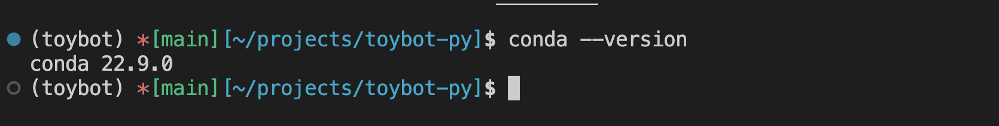

# ToyBot Application

Welcome to Toybot Simulator.\
This game lets you control a toyrobot in a 5 by 5 field.\
Below are the available commands to use.\
Type them correctly as commands are case sensitive.

- "PLACE X,Y,F" => Place the toy robot at index X,Y facing direction F. X and Y should be positive integer within the field and direction can only be NORTH, EAST, WEST, or SOUTH.
- "MOVE" => Move the toy robot 1 step facing the current direction, if the move makes it go out of the field, the command is ignored.
- "LEFT" => Turn the toy robot counter-clockwise.
- "RIGHT" => Turn the toy robot clockwise.
- "REPORT" => Outputs the current X,Y and direction of the toy robot.

Have fun =)\
To quit press CTRL + C

## How to Setup

1. Install **Miniforge** CLI by following instructions on this [link](https://github.com/conda-forge/miniforge/#download). Once installed open terminal/CLI or Command Prompt on Windows and you should be able to run command `conda --version`. It should show something similar to below:
   
1. Clone this repository to your machine. Run command `git clone https://github.com/mortillan/toybot.git` or `git clone git@github.com:mortillan/toybot.git` depending on what protocol is allowed to you. For setting up ssh key you may refer to this [link](https://docs.github.com/en/authentication/connecting-to-github-with-ssh/about-ssh)
1. Go to the root directory of the cloned project then run `conda env create -n toybot --file conda.yml`.
1. Activate the newly created conda environment for python. Run `conda activate toybot`
1. Now you are ready to run the application. Run `python -m toybot`

### Note:

- To run unit tests, run `coverage run -m unittest`
- To generate code coverage, run `coverage report` for CLI output, for html format output run `coverage html`. A folder will be created `htmlcov`, open the file `index.html`
